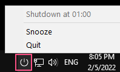

# 🛑 Shutd

> Auto shutdown utility tool for Windows with popup and snooze features



## 🔨 Build

`-ldflags -H=windowsgui` compile flags is to avoid opening a console at application startup

```
go install -ldflags -H=windowsgui ./cmd/shutd
```

## 🛠 Usage

If wanted to run it sliently (i.e. without any console popup) at start up, you may do the following

(Not sure why simply running `shutd.exe` in Startup with `-ldflags -H=windowsgui` could not trigger the shutdown properly)

1. Create a `shutd.vbs` at any folder
```
Set WshShell = CreateObject("WScript.Shell") 
gopath = WshShell.ExpandEnvironmentStrings("%GOPATH%")
WshShell.Run chr(34) & gopath & "\bin\shutd.exe" & Chr(34), 0
Set WshShell = Nothing
```

2. Create a shortcut and choose `shutd.vbs` that you created as target

3. Move the shortcut to start up folder, simply search `Startup` from Windows explorer

4. You should be able to see `shutd.exe` running in task manager next time when it starts up

## ⚙ Configuration

Following set of default configurations will be generated under home directory `%USERPROFILE%/.shutd.yaml`

Feel free to tweak it for your liking

After updated the configuration, `shutd` will automatically pick up the latest config, no need to restart it manually

```yaml
startTime: "01:00"
snoozeInterval: 15
notification:
  before: 10
  duration: 10
```

| Property                | Default Value | Remarks                                                             |
| ----------------------- | ------------- | ------------------------------------------------------------------- |
| `startTime`             | "01:00"       | Time for auto shutdown                                         |
| `snoozeInterval`        | 15            | Minutes that will snooze for shutdown                      |
| `notification.before`   | 10            | Minutes before shutdown for snooze popup notification     |
| `notification.duration` | 10            | Minutes for snnoze popup notification to default to not snooze |

## 📃 Logging

Log file will be generated under you home directory `%USERPROFILE%/.shutd.log`

Troubleshoot error there if wanted

## 🚢 Release

```
go install github.com/mitchellh/gox@latest

gox -os=windows -ldflags -H=windowsgui -output ./build/{{.Dir}}_{{.OS}}_{{.Arch}} ./cmd/shutd
```

## 📜 License

Distributed under the MIT License. See [LICENSE](./LICENSE) for more information.
